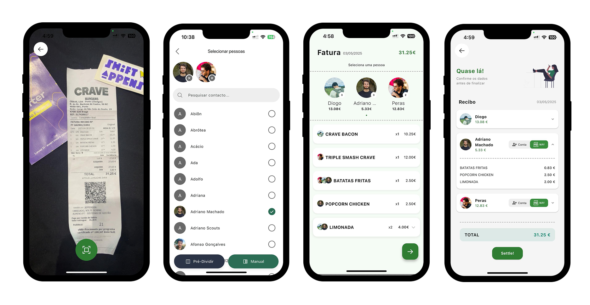
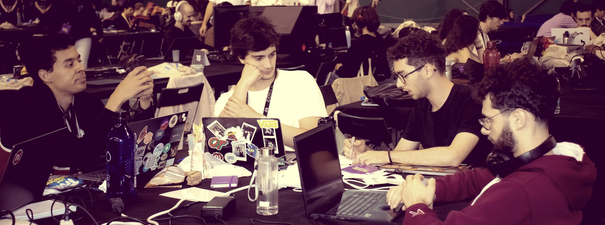

<div align="center">
    
    <h1>uSettle</h1>
</div>

## Overview

Scan a receipt, identifies all items and let users assign who ordered what to help settle debts quickly—either via MB Way or by tracking balances between friends.

<div align="center">
    
</div>

## Project Evolution

###  Napkins Wireframes


### Figma Mockups


### Prototype Screenshoots


## Technologies

- Prototypes: **Figma**
- Implementation: **Flutter** framework
- Receipt recognition: **Google Gemini** to process and extract data

## How to run the project

To run this project, ensure you have Flutter installed. If not, follow the official installation guide [here](https://flutter.dev/docs/get-started/install).

Once Flutter is installed, clone the repository and run the following commands in the root directory:

```bash
flutter pub get
flutter run
```

## Team



[Rubem Neto](https://github.com/rubuy-74) | [Diogo Goiana](https://github.com/DGoiana) | [João Torre Pereira](https://github.com/thePeras) | [Adriano Machado](https://github.com/Adriano-7) 
